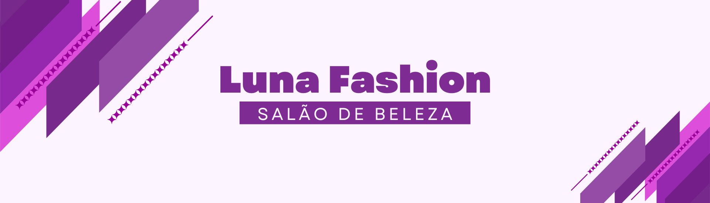

# Salão de Beleza Luna Fashion

Trabalho desenvolvido na disciplina de Projeto Integrador para o curso de Computação da Universidade Virtual do Estado de São Paulo (UNIVESP). Consiste no desenvolvimento de um software para divulgação do salão de beleza Luna Fashion. O objetivo é expandir a presença online do salão, atrair e gerenciar a carteira de clientes, otimizar o processo de agendamento e direcionar os clientes para a rede social Instagram e o aplicativo de mensagem WhatsApp.

**_Este repositório possui os arquivos referente ao front-end._**

_Banner Luna Fashion criado na ferramenta Canva_

_Visão geral do front-end_

## Versão Online

Acesse a versão online do Salão Luna Fashion no Netlify: [Luna Fashion](https://lunafashion.netlify.app/home).

## Tecnologias Utilizadas

- **Front-end**: Angular 17 com Bootstrap 5.3.3
- **Back-end**: Java 17 com Spring Boot 3
- **Banco de Dados**: MySQL
- **Controle de Versão**: GitHub

## Criação

- Mobile first
- Componentes reutilizáveis
- Design responsivo
- HTML semântico

## Funcionalidades

1. **Portfólio do Salão**: O site exibe informações sobre os serviços oferecidos pelo salão, incluindo imagens do acervo pessoal da proprietária e imagens ilustrativas retiradas do site https://www.freepik.com
2. **Redes Sociais**: Links para o Instagram e WhatsApp do salão para facilitar a comunicação com os clientes.
3. **Agendamento Online** _(em construção)_: Os clientes podem verificar a disponibilidade de horários e agendar serviços diretamente pelo site.

## Como Contribuir

Caso queira realizar contribuições para o projeto:

1. Faça um fork deste repositório.
2. Clone o fork para sua máquina.
3. Crie uma branch para suas alterações: `git checkout -b minha-feature`.
4. Realize as alterações desejadas e faça commit: `git commit -m "Minha alteração"`.
5. Envie as alterações para o seu fork: `git push origin minha-feature`.
6. Abra um pull request neste repositório.

## Instalação e Execução

1. Certifique-se de ter o Angular 17 e o Node.js v20.10.0.
2. Clone este repositório: `git clone https://github.com/ValeItalo/salao-luna-fashion.git`.
3. Abra o projeto na IDE de sua preferência
4. No terminal da IDE, execute o comando `npm install`
5. Execute o front-end (Angular): `ng serve`.
6. Acesse a aplicação em `http://localhost:4200`.
